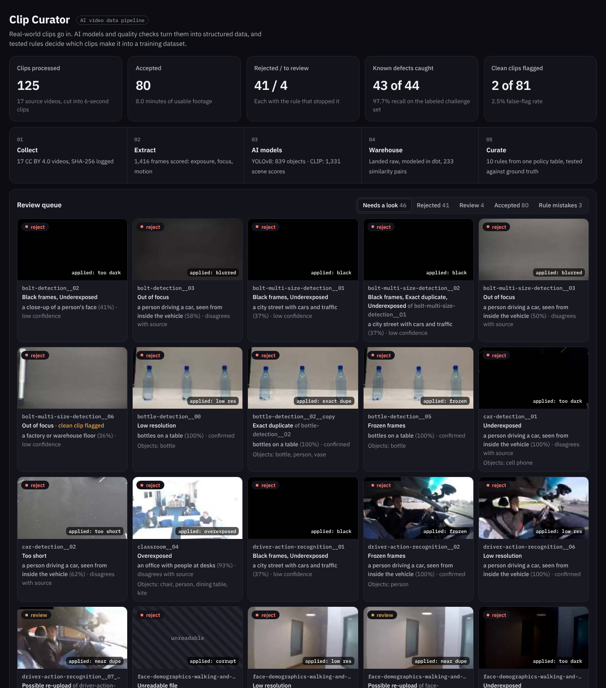
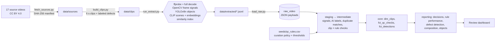

# Clip Curator

An AI video data pipeline that decides which clips are good enough for a training dataset.

Clips go in. Computer-vision models and signal checks turn every clip into structured data: objects, scenes, exposure, focus, motion, duplicates and file integrity. That data lands in a warehouse, where dbt applies a governed set of curation rules. Each clip gets **accept**, **review** or **reject**, with the reason attached. The rules are scored against a labeled challenge set, and the build fails if they get worse.



## Results on the current run

| | |
|---|---|
| Clips processed | 125 six-second clips from 17 real source videos |
| Accepted | 80 clips, 8 minutes of usable footage |
| Known defects caught | **43 of 44 (97.7% recall)** |
| Clean clips wrongly flagged | 2 of 81 (2.5%) |
| AI scene labels agreeing with the source | 56% of accepted clips, so the labels go to human review rather than being trusted |

## Why a challenge set

You can't measure a QC rule without knowing the right answer. `ingest/build_clips.py` cuts the real footage into clips. Then, with a fixed seed, it applies one known defect to about a third of them:

| Defect | What it simulates |
|---|---|
| blurred | out-of-focus capture |
| too dark / overexposed | bad exposure |
| frozen | stalled capture, same frame repeated |
| black | dead feed or lens cap |
| low res | 160 px upload |
| too short | 1-second fragment |
| corrupt | file truncated mid-upload |
| exact dupe | the same file submitted twice |
| near dupe | the same footage re-encoded, cropped and re-uploaded |

Because the answers are known, every rule gets a real precision and recall in `rpt_rule_performance`. The misses are reported, not hidden:

- **One near-duplicate slipped through.** The crop and re-compression moved its CLIP embedding below the 0.90 similarity cutoff, so it never became a candidate pair.
- **One clean clip was rejected as out of focus.** The source camera really is soft.
- **One clean clip was sent to review** as a possible re-upload. It's a static camera shot that looks almost identical to its neighbor.

## Architecture



**Extract does no deciding.** The models and signal extractors only measure. Every threshold lives in `seeds/qc_rules.csv` (one row per rule: action, target defect, threshold, description), and `int_clip_rule_checks` reads it from there. Tuning a rule is a one-cell edit plus `dbt build`, with no need to re-run the models.

## What gets extracted per clip

- **File:** codec, resolution, fps, duration, size, SHA-256, and a full ffmpeg decode that counts errors. A truncated file fails here.
- **Frames (2 per second):** brightness, contrast, sharpness (variance of the Laplacian), share of clipped highlights and crushed shadows, motion against the previous sample, and a 64-bit perceptual hash.
- **YOLOv8n:** COCO object detections every 1.5 seconds, with confidence and box size.
- **CLIP ViT-B/32:** zero-shot scene probabilities and a 512-d embedding.
- **Similarity index:** clip pairs that look alike to CLIP, with how closely their motion and brightness curves track over time. A re-upload tracks its original almost perfectly; two shots from the same fixed camera don't.

## Tests and quality gates

`dbt build` runs 44 tests:

- **Quality gates** (singular tests that fail the build):
  - `assert_defect_recall_meets_gate`: at least 85% of known defects stopped
  - `assert_false_flag_rate_under_limit`: no more than 5% of clean clips flagged
- **Dataset guarantees:**
  - `assert_no_duplicates_in_accepted_set`
  - `assert_accepted_clips_pass_reject_rules`
  - `assert_every_clip_decided`: every clip is checked by every rule
- **Schema tests:** uniqueness, relationships (detections → clips, checks → rules, clips → source catalog), accepted values, and value ranges, such as detection confidence at or above the 0.45 cutoff

## Run it

```bash
git clone https://github.com/evannwilsonn/clip-curator.git
cd clip-curator
python -m venv .venv && source .venv/bin/activate
make setup   # CPU-only PyTorch, YOLOv8, open_clip, dbt-duckdb
make all     # fetch → clips → extract (≈2 min on CPU) → load → dbt build → dashboard
make serve   # http://localhost:8000
```

Model weights download on first run (YOLOv8n from Ultralytics, CLIP from LAION via Hugging Face).

## Run the warehouse on Snowflake

Staging reads the JSON payloads through a dispatch macro: DuckDB `->>` locally, Snowflake `VARIANT:"key"` in production. The Snowflake path is written to run as-is but has only been run end to end on DuckDB so far.

```bash
pip install dbt-snowflake
snowsql -a <account> -u <user> -f ingest/snowflake_load.sql
export SNOWFLAKE_ACCOUNT=<account> SNOWFLAKE_USER=<user> SNOWFLAKE_PASSWORD=<password>
dbt build --target snowflake
```

## Footage and models

- **Footage:** [Intel IoT DevKit sample videos](https://github.com/intel-iot-devkit/sample-videos), CC BY 4.0. The clips and challenge-set defects are derived from it. This repo doesn't redistribute the video; `make fetch` downloads it.
- **Models:** [YOLOv8n](https://github.com/ultralytics/ultralytics) (AGPL-3.0) and [OpenCLIP ViT-B/32, LAION-2B](https://github.com/mlfoundations/open_clip).

Built by Evan Wilson · Python · OpenCV · PyTorch · YOLOv8 · CLIP · DuckDB · dbt · Snowflake · SQL
