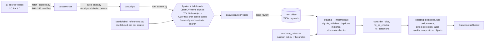

# Clip Curator

An AI video data pipeline that decides which clips are good enough for a training dataset.

Clips go in. Computer-vision models and signal checks turn every clip into structured data: objects, scenes, exposure, focus, motion, duplicates and file integrity. That data lands in a warehouse, where dbt applies a governed set of curation rules. Every clip is automatically **accepted** or **rejected**, with the reason attached. There is no manual review queue. The rules and the AI labels are scored against known answers on every build, the build fails if they slip, and a second run of the models reproduces every number byte for byte.


## Results on the current run

| | |
|---|---|
| Clips processed | 125 six-second clips from 17 real source videos |
| Accepted | 81 clips, 8.1 minutes of usable footage |
| Known defects rejected | **44 of 44 (100%)** |
| Clean clips wrongly rejected | **0 of 81** |
| AI scene labels correct | **72 of 72 (100%)** few-shot, vs. 68 of 72 (94.4%) for zero-shot text prompts |
| Reproducible | A second run of the full AI extraction matches the first byte for byte (`make verify`) |

## Why a challenge set

You can't measure a QC rule without knowing the right answer. `ingest/build_clips.py` cuts the real footage into clips. Then, with a fixed seed, it applies one known defect to about a third of them:

| Defect | What it simulates |
|---|---|
| blurred | out-of-focus capture |
| too dark / overexposed | bad exposure |
| frozen | stalled capture, same frame repeated |
| black | dead feed or lens cap |
| low res | 160 px upload |
| too short | 1-second fragment |
| corrupt | file truncated mid-upload |
| exact dupe | the same file submitted twice |
| near dupe | the same clip re-uploaded: downscaled to 480 px and re-encoded at lower quality, the way platforms transcode uploads |

Because the answers are known, every rule gets a real precision and recall in `rpt_rule_performance`, and the dashboard lists any mistakes by name.

## How it stays accurate

The first version scored 43 of 44 with 2 false alarms and only 56% label accuracy. Three changes took it to 100% across the board:

- **Re-uploads are matched frame by frame, not by look.**
  - The footage is mostly fixed cameras, so two different moments from the same camera look nearly identical. Looks alone can't tell a re-upload from the next clip.
  - Instead, the pipeline lines up 16 frames from each candidate pair in time and compares them. A re-upload lines up one-for-one, so its aligned difference is far smaller than its difference to non-matching frames. Two different moments from the same camera don't line up.
  - The rule uses that ratio (`alignment_ratio`).
  - **The closest call:** a re-upload of an almost-still hallway shot scores 0.60 against the 0.62 cutoff, and the nearest clip that isn't a duplicate scores 0.64. Any new footage should be checked against that margin.
- **Blur is judged against the camera, not a single cutoff.** A clip is out of focus only if it's both under the absolute sharpness floor and under half of the same source's typical sharpness. That keeps a naturally soft camera from being rejected as blurry.
- **Scene labels come from examples, not just text prompts.**
  - Zero-shot CLIP mistook a grey conveyor belt for asphalt, and people pausing in a hallway for portraits.
  - The pipeline now labels few-shot. `seeds/label_references.csv` names one labeled reference clip per source video. Their CLIP embeddings are averaged into one centroid per scene, and every other clip takes the nearest centroid.
  - Accuracy is measured only on clips that weren't references.

Runs are deterministic: the clip builder uses a fixed seed, the models run with a fixed seed and thread count, and nothing time- or machine-specific is written to the outputs. `make verify` re-runs the AI extraction and fails if any output file differs.

## Architecture



**Extract does no deciding.** The models and signal extractors only measure. Every threshold lives in `seeds/qc_rules.csv` (one row per rule: action, target defect, threshold, description), and `int_clip_rule_checks` reads it from there. Tuning a rule is a one-cell edit plus `dbt build`, with no need to re-run the models.

## What gets extracted per clip

- **File:** codec, resolution, fps, duration, size, SHA-256, and a full ffmpeg decode that counts errors. A truncated file fails here.
- **Frames (2 per second):** brightness, contrast, sharpness (variance of the Laplacian), share of clipped highlights and crushed shadows, motion against the previous sample, and a 64-bit perceptual hash.
- **YOLOv8n:** COCO object detections every 1.5 seconds, with confidence and box size.
- **CLIP ViT-B/32:**
  - A 512-d embedding from 5 frames.
  - Few-shot similarity to every scene centroid; this is the label the dataset uses.
  - Zero-shot probabilities from prompt ensembles, kept as a baseline.
- **Duplicate search:**
  - CLIP narrows the candidates to pairs at least 0.85 similar.
  - 16 time-aligned frames per clip (64×36, normalized) are compared, recording `aligned_diff` and `alignment_ratio`.

## Tests and quality gates

`dbt build` runs 49 tests:

- **Quality gates** (singular tests that fail the build):
  - `assert_defect_recall_meets_gate`: at least 95% of known defects rejected
  - `assert_false_flag_rate_under_limit`: no more than 2% of clean clips rejected
  - `assert_label_accuracy_meets_gate`: at least 95% of scene labels correct
- **Dataset guarantees:**
  - `assert_no_duplicates_in_accepted_set`
  - `assert_accepted_clips_pass_reject_rules`
  - `assert_every_clip_decided`: every clip is checked by every rule
- **Schema tests:** uniqueness, relationships (detections → clips, checks → rules, clips → source catalog), accepted values, and value ranges, such as detection confidence at or above the 0.45 cutoff

## Run it

```bash
git clone https://github.com/evannwilsonn/clip-curator.git
cd clip-curator
python -m venv .venv && source .venv/bin/activate
make setup   # CPU-only PyTorch, YOLOv8, open_clip, dbt-duckdb
make all     # fetch → clips → extract (≈3 min on CPU) → load → dbt build → dashboard
make verify  # re-run the AI extraction and confirm identical output
make serve   # http://localhost:8000
```

Model weights download on first run (YOLOv8n from Ultralytics, CLIP from LAION via Hugging Face).

## Run it on Snowflake

This project has been built end to end on Snowflake (`dbt build --target snowflake`). Every test passes there, and the reporting tables match the DuckDB build number for number. The models use cross-database macros (`macros/cross_db.sql`), so the same SQL runs on both.

Sign-in is key-pair, so no password is stored anywhere. After running the pipeline locally (`make all`), copy the raw layer up and build:

```bash
pip install dbt-snowflake snowflake-connector-python
export SNOWFLAKE_ACCOUNT=<org-account> SNOWFLAKE_USER=<user>
export SNOWFLAKE_PRIVATE_KEY_PATH=~/.snowflake/rsa_key.p8 SNOWFLAKE_ROLE=SYSADMIN
python ingest/load_snowflake.py --duckdb warehouse/clip_curator.duckdb --database CLIP_CURATOR --schemas raw_video
dbt build --target snowflake
```

`ingest/load_snowflake.py` writes each raw table to Parquet, uploads it to an internal stage, loads it with `COPY INTO` and checks the row counts against DuckDB. `ingest/snowflake_load.sql` is the equivalent SnowSQL script for loading straight from the extracted files.

## Footage and models

- **Footage:** [Intel IoT DevKit sample videos](https://github.com/intel-iot-devkit/sample-videos), CC BY 4.0. The clips and challenge-set defects are derived from it. This repo doesn't redistribute the video; `make fetch` downloads it.
- **Models:** [YOLOv8n](https://github.com/ultralytics/ultralytics) (AGPL-3.0) and [OpenCLIP ViT-B/32, LAION-2B](https://github.com/mlfoundations/open_clip).

Built by Evan Wilson · Python · OpenCV · PyTorch · YOLOv8 · CLIP · DuckDB · dbt · Snowflake · SQL

## Rebuilding the warehouse without the AI models

`snapshots/extracted.tar.gz` holds the output of the extraction step (`data/extracted/`) from the published run. To rebuild the warehouse and dashboard without installing PyTorch or downloading video, unpack it and run the load and dbt steps:

```bash
mkdir -p data && tar -xzf snapshots/extracted.tar.gz -C data
python ingest/load_raw.py && dbt build
```
